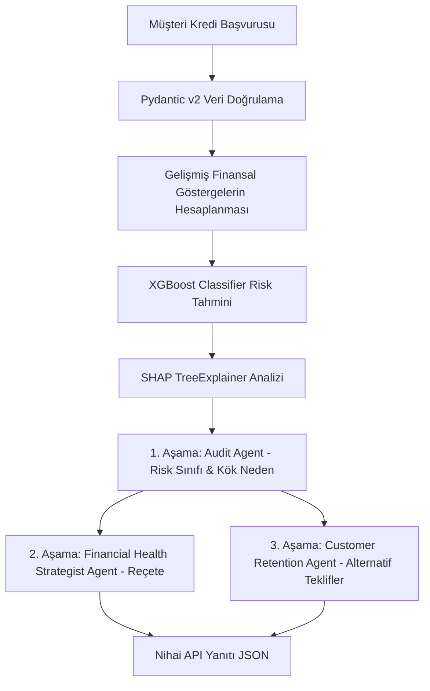

# 🚀 Explainable AI & Agentic Credit Scoring Engine

[](https://www.python.org/)
[](https://fastapi.tiangolo.com/)
[](https://xgboost.readthedocs.io/)
[](https://ollama.com/)
[](LICENSE)

Kurumsal düzeyde (**Enterprise-Grade**), açıklanabilir yapay zeka (XAI) ve çok ajanlı karar verme mekanizmalarını (**Agentic LLM Workflow**) birleştiren yeni nesil bir **Kredi Skorlama ve Karar Destek Motoru**. 

Bu proje; klasik kredi skorlama algoritmalarının ötesine geçerek, **XGBoost** ile risk tahmini yapar, **SHAP TreeExplainer** ile kararları şeffaflaştırır ve yerel olarak çalışan **Qwen 2.5 (Ollama)** modeli üzerinde simüle edilen **3 Aşamalı Ajantik Akış (Multi-Agent Reasoning)** ile reddedilen müşteriler için finansal iyileştirme reçeteleri ve alternatif risksiz ürün teklifleri sunar.

---

## 📌 Mimari ve Veri Akışı

Sistem, uçtan uca tamamen asenkron ve modüler bir mimariyle tasarlanmıştır. Veri akış şeması aşağıda gösterilmiştir:



---

## 🛠️ Teknolojik Altyapı ve Katmanlar

### 1. Gelişmiş Veri Katmanı (Feature Engineering)
Sistem, temel finansal verileri alarak bankacılık standartlarında karmaşık finansal rasyolar üretir:
*   **Varlık Likidite Oranı (Liquidity Ratio)**: Müşterinin varlıklarının borçlarına oranını analiz eder.
    $$\text{Liquidity Ratio} = \frac{\text{Savings}}{\text{Debt} + 1.0}$$
*   **Borç Servis Karşılama Oranı (DSCR - Debt Service Coverage Ratio)**: Müşterinin aylık net gelirinin mevcut aylık borç yükümlülüklerini karşılama kapasitesini ölçer.
    $$\text{DSCR} = \frac{\text{Income}}{\text{Monthly Debt Payment} + 1.0}$$

### 2. Explainable AI (XGBoost & SHAP) Katmanı
*   **XGBoost Classifier**: Sentetik ve gerçekçi finansal kurallarla eğitilmiş makine öğrenmesi modeliyle müşterinin kredi temerrüt riskini tahmin eder.
*   **SHAP TreeExplainer**: Karar ağacı tabanlı modelin kararlarını öznitelik seviyesinde matematiksel olarak açıklar:
    *   **En Yüksek Riski Oluşturan İlk 3 Negatif Faktör** (SHAP değeri pozitif olanlar).
    *   **Riski En Çok Düşüren İlk 2 Pozitif Faktör** (SHAP değeri negatif olanlar).

### 3. Çok Aşamalı Ajantik Akış (Local Multi-Agent System)
Yerelde Ollama üzerinden çağrılan **Qwen 2.5:7b** modeli, JSON modu zorlaması (`format="json"`) ile 3 farklı ajan rolünü üstlenir:
*   **Aşama 1: Audit Agent (Denetim Ajanı)**: Finansal verileri ve SHAP çıktılarını değerlendirerek risk sınıfını (`LOW`, `MEDIUM`, `HIGH`, `CRITICAL`) ve riskin kök nedenini belirler.
*   **Aşama 2: Financial Health Strategist Agent (Finansal Sağlık Stratejisti)**: Kök nedene bağlı kalarak müşteriye özel **30, 60 ve 90 günlük gelişim reçeteleri** hazırlar.
*   **Aşama 3: Customer Retention Agent (Müşteri Elde Tutma Ajanı)**: Olumsuz değerlendirilen müşteriyi rakip kurumlara kaptırmamak amacıyla risk profiline uygun alternatif risksiz ürün teklifleri sunar (Örn: *Nakit Bloke Teminatlı Kart*, *Otomatik Fatura Talimatlı Mikro-Limit*).

---

## 🚀 Kurulum ve Çalıştırma

### 1. Gereksinimler
*   Python 3.10 veya üzeri
*   [Ollama](https://ollama.com/) uygulaması

### 2. Yerel Modelin Hazırlanması
Ollama uygulamasını başlattıktan sonra terminalden Qwen 2.5 modelini indirin:
```bash
ollama pull qwen2.5:7b
```

### 3. Proje Bağımlılıklarının Yüklenmesi
Gerekli kütüphaneleri yüklemek için aşağıdaki komutu çalıştırın:
```bash
pip install fastapi uvicorn xgboost shap pydantic ollama httpx numpy pandas scikit-learn
```

### 4. Uygulamanın Çalıştırılması
FastAPI sunucusunu başlatmak için:
```bash
uvicorn main:app --reload
```
Uygulama ayağa kalkarken otomatik olarak sentetik veri kümesi oluşturup XGBoost modelini eğitir ve SHAP explainer kurulumunu tamamlar.

---

## 🧪 API Test Etme

Sistemle entegrasyonu test etmek için proje ana dizinindeki `ornekmusteridata.json` dosyasından 100 adet müşteri verisi okunur. Ardından projedeki [test_client.py](test_client.py) dosyası çalıştırılarak bu veriler üzerinde asenkron testler gerçekleştirilir:
```bash
python test_client.py
```

Test başarıyla tamamlandıktan sonra, elde edilen tüm başarılı model ve ajantik akış yanıtları otomatik olarak proje ana dizininde aşağıdaki formatlarda kaydedilir:
1.  **`test_sonuclari.json`**: API'den dönen ham yanıtların JSON geçmişi.
2.  **`test_sonuclari.md`**: Finansal faktörlerin ne anlama geldiğini açıklayan terimler sözlüğü, kredi onay/red statüsü ve her müşteri için özel olarak üretilmiş "Müşteriye Gösterilecek Mesaj" bölümlerini içeren şık ve kurumsal test raporu.

### Örnek İstek Gövdesi (Request Body)
`POST /score` endpoint'ine gönderilecek JSON verisi:
```json
{
  "income": 50000.0,
  "savings": 15000.0,
  "debt": 80000.0,
  "monthly_debt_payment": 6000.0,
  "inquiry_count": 5,
  "sector_risk_index": 0.75,
  "loan_amount": 250000.0,
  "loan_duration": 24
}
```

### Örnek API Yanıtı (Response)
```json
{
  "client_data": {
    "income": 50000.0,
    "savings": 15000.0,
    "debt": 80000.0,
    "monthly_debt_payment": 6000.0,
    "inquiry_count": 5,
    "sector_risk_index": 0.75,
    "loan_amount": 250000.0,
    "loan_duration": 24,
    "liquidity_ratio": 0.18749,
    "dscr": 8.3319
  },
  "shap_explanation": {
    "probability": 0.9621,
    "negative_factors": [
      {
        "feature": "liquidity_ratio",
        "shap_value": 1.6303
      },
      {
        "feature": "sector_risk_index",
        "shap_value": 1.3621
      },
      {
        "feature": "inquiry_count",
        "shap_value": 1.0889
      }
    ],
    "positive_factors": [
      {
        "feature": "monthly_debt_payment",
        "shap_value": -0.0224
      },
      {
        "feature": "loan_duration",
        "shap_value": -0.0102
      }
    ]
  },
  "agentic_workflow": {
    "audit": {
      "risk_class": "MEDIUM",
      "root_cause_category": "Yüksek Borçluluk ve Likidite Yetersizliği",
      "audit_summary": "Müşterinin finansal durumu orta seviyededir. Yüksek borçları ve düşük likiditesi risk faktörlerini tetikliyor..."
    },
    "strategist": {
      "roadmap_30_days": {
        "actions": [
          {
            "step": 1,
            "description": "Borç yapılandırma",
            "details": "Ortaya çıkan borçları yapılandırarak aylık yükümlülükleri azaltma..."
          }
        ]
      },
      "roadmap_60_days": { ... },
      "roadmap_90_days": { ... }
    },
    "retention": {
      "alternative_products": [
        {
          "product_name": "Nakit Bloke Teminatlı Kart",
          "reason_and_benefits": "Bu ürün, müşterinin kredi kullanma ihtiyacını karşılarken ek borç riski oluşturmaz..."
        }
      ]
    }
  }
}
```

---

## 💼 Bankacılık & FinTech Katkısı
Bu motor, bankacılıkta **Açıklanabilir Yapay Zeka (Explainable AI - XAI)** standartlarına tam uyum sağlar. Kredi politikaları doğrultusunda kara kutu (black-box) modellerin neden red kararı verdiğini **SHAP** ile şeffaflaştırırken, **Ajantik Akış** sayesinde red alan müşterilere doğrudan dijital kanallarda alternatif ürünler sunarak müşteri kaybını (**customer churn**) engeller.

---

## 📝 Lisans
Bu proje MIT lisansı altında lisanslanmıştır. Detaylar için [LICENSE](LICENSE) dosyasına göz atabilirsiniz.
